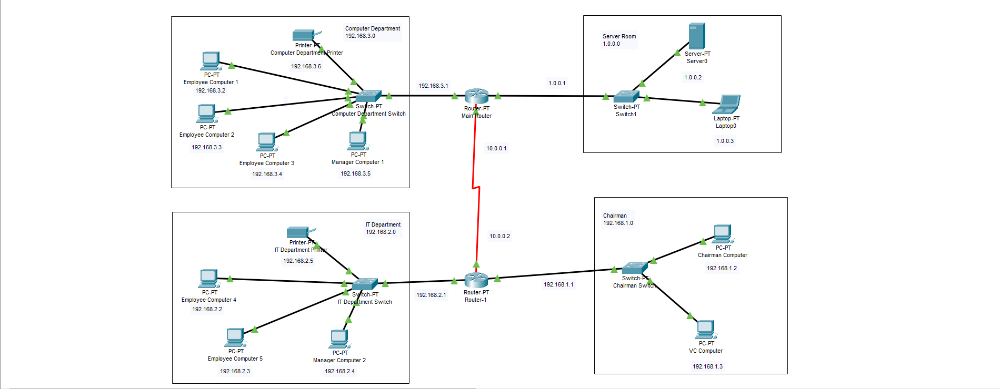

# Small Office Network Project

Welcome to the Small Office Network project using Cisco Packet Tracer. This project simulates a small office network with four distinct networks: 
- Server Room 
- Chairman Room 
- IT Department
- Computer Department. 
This README file will guide you through the installation process, provide tutorials for learning Cisco Packet Tracer, and include steps for configuring end devices, switches, and routers.

# Configuration Steps

### Configuring End Devices (PCs)
- Assign IP Address:
    - Click on the PC.
    - Go to the Desktop tab.
    - Select IP Configuration.
    - Enter the IP address, subnet mask, and default gateway.
### Configure Router:
- Click on the router.
- Assign IP address to the router
- Assign static routing in order to send and receive packets from different networks. Refer to the tutorial mentioned above.

# Screenshots

